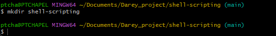
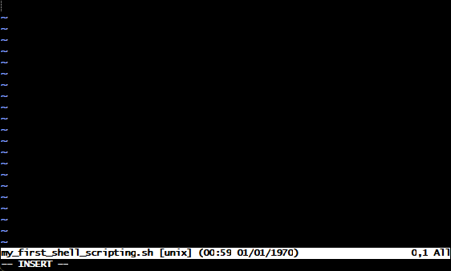
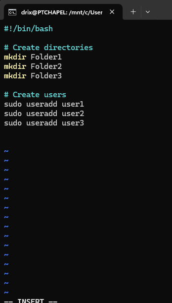
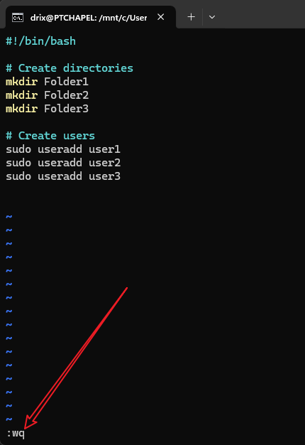
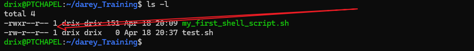
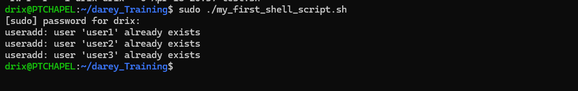

# Shell Scripting Mini-Project Documentation
This document details the process of completing a shell scripting mini-project on an Ubuntu server. The goal is to create a shell script that automates the creation of directories and users.

---

## Shell Script Code

Below is example code for the shell script that creates three directories and three users.

```bash
#!/bin/bash

# Create directories
mkdir Folder1
mkdir Folder2
mkdir Folder3

# Create users
sudo useradd user1
sudo useradd user2
sudo useradd user3
```

---

### Task for you
1. Create a folder on a ubuntu server and name it shell-scripting.
2. Using the `vim` editor, create a file called `my_first_shell_script.sh`.
3. Put the shell script code above into the new file.
4. Save the file.
5. Use `cd` command to change into the `shell-scripting` directory.
6. Use `ls -latr` command to confirm that the file is indeed creeated. 


## Step 1: Create a Folder on an Ubuntu Server

**Task:** Create a folder named `shell-scripting`.

**Command:**

```bash
mkdir shell-scripting
```

**Output:**



---

## Step 2: Create a File Using the Vim Edi addtor

**Task:** Use the Vim editor to create a file called `my_first_shell_script.sh`.

**Command:**

```bashg
vim my_first_shell_script.sh
```

**Action:**

- Vim opens in command mode.
- Press `i` to enter insert mode.



---

## Step 3: Add the Shell Script Code

**Task:** Add the shell script code to the new file.

**Code Added in Vim:**

```bash
#!/bin/bash

# Create directories
mkdir Folder1
mkdir Folder2
mkdir Folder3

# Create users
sudo useradd user1
sudo useradd user2
sudo useradd user3
```

**Screenshot:**  


---

## Step 4: Save the File

**Task:** Save the file in Vim.

**Action:**

- Press `Esc` to exit insert mode.
- Type `:wq` and press `Enter` to save and exit.

**Screenshot:**  


---

## Step 5: Change into the `shell-scripting` Directory

**Task:** Change into the created directory.

**Command:**

```bash
cd shell-scripting
```

**Screenshot:**  


---

## Step 6: Confirm the File Exists Using `ls -latr`

**Task:** Check for the script file and its permissions.

**Command:**

```bash
ls -latr
```
**Screenshot:**  


---

If the script is run without making it executable, it will not run and will throw up a permission denied error. See screenshot below.


---

### Task for you 2: 
1. Add the execute permission for the `owner` to be able to execute the shell script.
2. Run the shell script.
3. Evaluate and ensure that 3 folders are created
4. Evaluate and ensure that 3 users are created on the linux server

## Step 1: Add Execute Permission for the Owner

**Task:** Make the script executable.

**Command:**

```bash
chmod u+x my_first_shell_script.sh
```

**Verification:**

```bash
ls -l
```

**Screenshot:**  


---

## Step 2: Run the Shell Script

**Task:** Execute the script.

**Command:**

```bash
sudo ./my_first_shell_script.sh
```

**Note:** `sudo` is required for user creation.

**Screenshot:**  


---

## Step 3: Verify Folders Were Created

**Task:** Check for the folders.

**Command:**

```bash
ls
```

**Screenshot:**  


---

## Step 4: Verify Users Were Created

**Task:** Confirm the users exist.

**Command:**

```bash
id user1 && id user2 && id user3
```

**Screenshot:**  


---
### Shebang
The shebang `#!/bin/bash` at the top of the script indicates that the script should be run using the Bash shell. This is important for ensuring that the script runs correctly, as different shells may have different syntax and features.

### Variable Declaration and initialization
Variables are essential in shell scripting for storing data that can be reused throughout the script. They are declared using the syntax `variable_name=value` and can be accessed using `$variable_name`. For example:

```bash
#!/bin/bash
# Assigning a value to a variable
name="John"
```
## Retrieving value from a variable
Echoing the value of a variable is done using the `echo` command followed by the variable name prefixed with `$`. For example:

```bash
echo $name
```
**screenshot:**


### Adding comments in Bash Scripts
Comments explain what the script does and are ignored by the shell when executing the script. They start with a `#` symbol.

## Type of comments
1. **Single-line comments:** Start with `#` and continue to the end of the line.
```bash
   # This is a single-line comment in Bash 
   echo "Hello, you are learning Bash Scripting on DAREY.IO!" # This is also a comment, following a command
```

2. **Multi-line comments:** This anothe way to create comments in bash scripts. Each line starts with `#`. It's used adding brief descriptions of the script's functionality or purpose. For example:
```bash
   # This is another way to create comments in bash scripts.
   # Each line starts with a #.
   # It's used for adding brief descriptions of the script's functionality or purpose.
   ```

   ### Conclusion
This mini-project demonstrates the process of creating a shell script to automate directory and user creation on an Ubuntu server. The steps include creating a folder, writing a script using Vim, making the script executable, and verifying the creation of directories and users. This project serves as a foundational exercise in shell scripting and Linux command-line usage.

